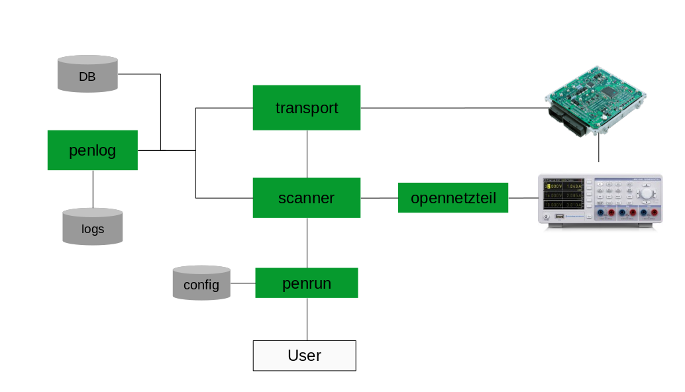

<!--
SPDX-FileCopyrightText: AISEC Pentesting Team

SPDX-License-Identifier: CC0-1.0
-->

# Architecture

This documentation describes the inner design concepts of gallia.

The following diagram shows the internal modules of gallia and how they are connected:

## Scanner Lifecycle

This section describes the livecycle of a scanner.
Meaning, which methods are called in which order when executing a scanner.

1. {meth}`gallia.cli.main`
2. {meth}`gallia.services.udscan.core.GalliaBase.run`
3. {meth}`gallia.services.udscan.core.GalliaBase._run`
4. {meth}`gallia.services.udscan.core.Scanner.setup`
5. {meth}`gallia.services.udscan.core.GalliaBase.main`
6. {meth}`gallia.services.udscan.core.Scanner.teardown`

## Argument Parsing

In gallia, there is a central argument parser ({attr}`gallia.services.udscan.core.GalliaBase.parser`),
where all scanner are added as sub-commands.
Scanner can add their specific options by implementing the {meth}`gallia.services.udscan.core.GalliaBase.add_parser` method.
With this approach, we can generate a usage, which lists all installed scanners.
To see the scanner specific usage, the user can query the help of the specific sub-command.

## Plugin Interface

There are different plugin interfaces to extend gallia.
All of them use the python `entry point` concept:

1. Scanner API (`gallia_scanners`)
2. ECU API (`gallia_ecus`)
3. Transport protocols (`gallia_transports`)

## OEM Specific Implementations

Gallia is designed with the concept of OEM/vendor specific extensions in mind.
The generic {class}`~gallia.services.uds.ecu.ECU` class covers the basic functionality, which can be found by (almost) all OEMs.
OEM specific ECUs can extend or overwrite the generic {class}`~gallia.services.uds.ecu.ECU` functionality.

Typical OEM specific functionality includes:
* Reading properties like: software version, UUID, ECU name, ...
* Flashing
* Security Access
* Changing to vendor specific sessions
