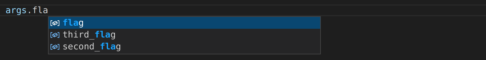
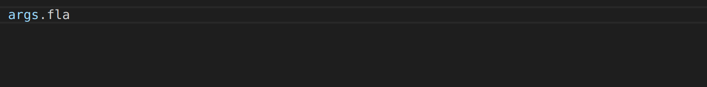
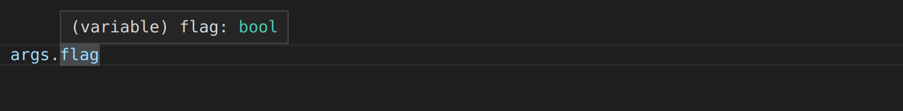
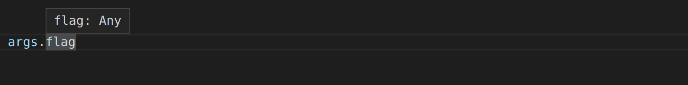
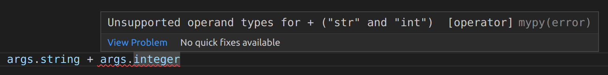
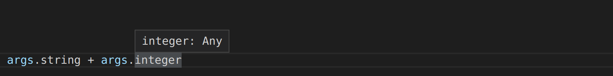

## Feature Showcase
This showcase demonstrates how `pydantic-argparse` can be useful, by
highlighting some of its features and showing how they can be utilised.

### CLI Construction
The `pydantic-argparse` command-line interface construction is simple.

=== "Pydantic Argparse"
    ```python
    import pydantic
    import pydantic_argparse

    # Declare Arguments
    class Arguments(pydantic.BaseModel):
        # Required Arguments
        string: str = pydantic.Field(description="a required string")
        integer: int = pydantic.Field(description="a required integer")
        flag: bool = pydantic.Field(description="a required flag")

        # Optional Arguments
        second_flag: bool = pydantic.Field(False, description="an optional flag")
        third_flag: bool = pydantic.Field(True, description="an optional flag")

    # Create Parser
    parser = pydantic_argparse.ArgumentParser(
        model=Arguments,
        prog="Example Program",
        description="Example Description",
        version="0.0.1",
        epilog="Example Epilog",
    )

    # Parse Arguments
    args = parser.parse_typed_args()
    ```

=== "Argparse"
    ```python
    import argparse

    # Create Parser
    parser = argparse.ArgumentParser(
        prog="Example Program",
        description="Example Description",
        epilog="Example Epilog",
        add_help=False,
    )

    # Functionally Add Argument Groups
    required = parser.add_argument_group(title="required arguments")
    optional = parser.add_argument_group(title="optional arguments")
    help = parser.add_argument_group("help")

    # Add Help Actions
    help.add_argument(
        "-h",
        "--help",
        action="help",
        help="show this help message and exit",
    )
    help.add_argument(
        "-v",
        "--version",
        action="version",
        version="0.0.1",
        help="show program's version number and exit",
    )

    # Add Required Arguments
    required.add_argument(
        "--string",
        type=str,
        required=True,
        help="a required string",
    )
    required.add_argument(
        "--integer",
        type=int,
        required=True,
        help="a required integer",
    )
    required.add_argument(
        "--flag",
        action=argparse.BooleanOptionalAction,
        required=True,
        help="a required flag",
    )

    # Add Optional Arguments
    optional.add_argument(
        "--second-flag",
        action="store_true",
        help="an optional flag (default: False)",
    )
    optional.add_argument(
        "--third-flag",
        action="store_false",
        help="an optional flag (default: True)",
    )

    # Parse Arguments
    args = parser.parse_args()
    ```

### Auto Completion
The `pydantic-argparse` parsed `args` support auto-completion in your IDE.

=== "Pydantic Argparse"
    

=== "Argparse"
    

### Type Hints
The `pydantic-argparse` parsed `args` support type-hinting in your IDE.

=== "Pydantic Argparse"
    

=== "Argparse"
    

### Type Safety
The `pydantic-argparse` parsed `args` support type-safety with `mypy`.

=== "Pydantic Argparse"
    

=== "Argparse"
    
